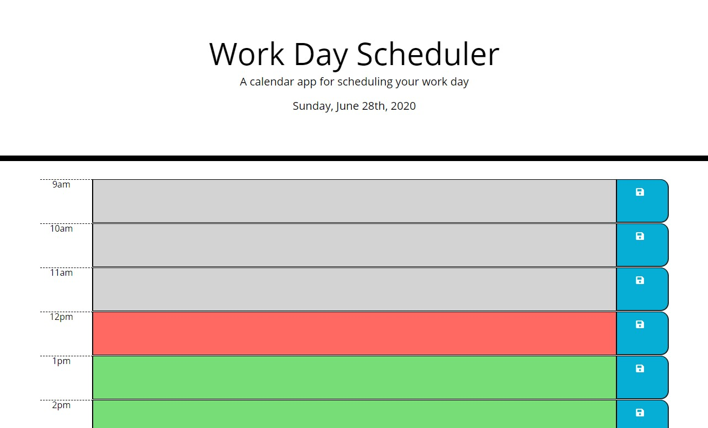
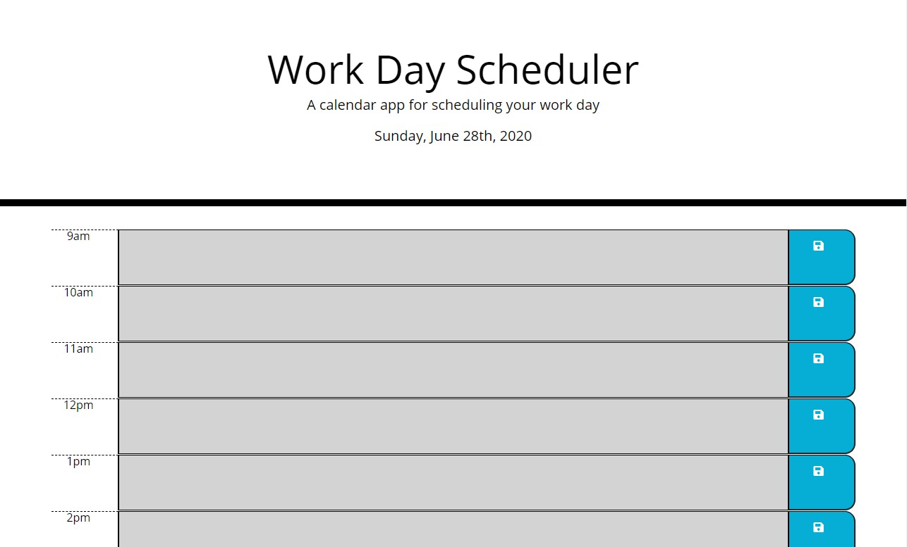

# 05 Third-Party APIs: Work Day Scheduler

Create a simple calendar application that allows the user to save events for each hour of the day. This app will run in the browser and feature dynamically updated HTML and CSS powered by jQuery.

You'll need to use the [Moment.js](https://momentjs.com/) library to work with date and time. Be sure to read the documentation carefully and concentrate on using Moment.js in the browser.

## User Story

```
AS AN employee with a busy schedule
I WANT to add important events to a daily planner
SO THAT I can manage my time effectively
```

## Acceptance Criteria

```
GIVEN I am using a daily planner to create a schedule
WHEN I open the planner
THEN the current day is displayed at the top of the calendar
WHEN I scroll down
THEN I am presented with timeblocks for standard business hours
WHEN I view the timeblocks for that day
THEN each timeblock is color coded to indicate whether it is in the past, present, or future
WHEN I click into a timeblock
THEN I can enter an event
WHEN I click the save button for that timeblock
THEN the text for that event is saved in local storage
WHEN I refresh the page
THEN the saved events persist
```

Sample screenshot of the from the password generator challenge:




REPOSITORY TITLE: lafry5/Work-day-scheduler
    
    Copied starter code from coding-boot-camp/super-disco. Updated the style.css file and created README.md and script.js files.


Repository Link: https://github.com/lafry5/Work-day-scheduler

Github Page: https://lafry5.github.io/Work-day-scheduler

TABLE OF CONTENTS:
    
    -  Clone
 
    -  Setup
 
    -  Contributing

    -  Description
 
    -  Support


Clone:
    Clone this repo to your local machine using https://lafry5.github.io/Work-day-scheduler


Setup:
    Ensure that all files are located in the root folder (Index, Readme, script, and style, as well as the screenshots).

Contributing:
    Starter code was provided for this assignment from coding-boot-camp/super-disco.

Description:
    This code will create a work day schedule for the current day (from 9am - 5pm). The schedule is color coded as follows: hours in the past are grey, the current hour is red, and hours in the future are green. The code will allow an input next to each hour from the user. If the user pushes the save button next to an input it will persist; if not the input will not be saved.  

    Examples screenshots are as follows:




 
Support:
    Reach out to me at one of the following places if you have any questions!

    Email: lafry5@yahoo.com 
    Cell: (602) 363-0253